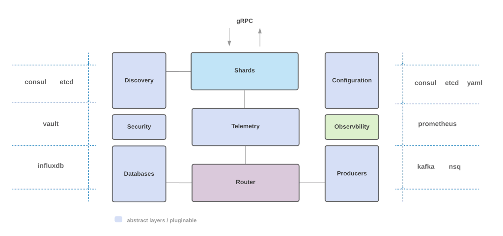
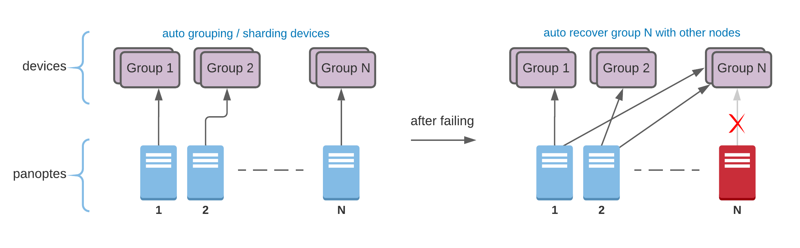
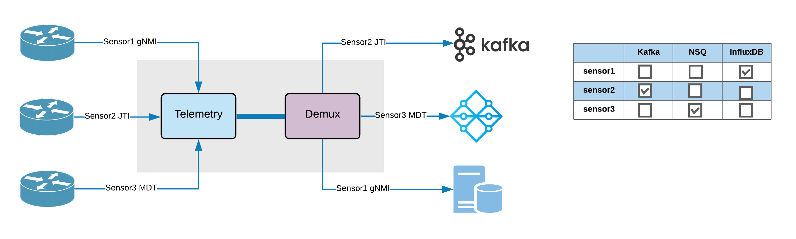

## Architecture
---------

At a high level, Panoptes-Stream consists of the following:

#### Telemetry

The telemetry can subscribe or unsubscribe **gNMI, JTI or MDT** telemetries for one or more sensors through gRPC. It optimized for Juniper, Cisco and Arista.

#### Configuration

The configuration supports **dynamic configuration** without requiring panoptes restart. It can read the configuration from a simple yaml file and well-known distributed key value store applications.

#### Shards

This component provides **scalability and availability** through auto sharding of network devices. Once the shards are enabled each panoptes instance is responsible for specified devices. In other words the shards groups the devices and assigns them to each instance to spread load and failover. In case of failure the other instances take over the load quickly.

#### Demux

The demux **routes metrics** to proper producers and databases based on the given configuration. It can be able to run different producers and databases concurrently. In case of the network latency or database/messaging bus maintenance the demux can write metrics to local drive to prevent any metrics losing and return them once they are backed up. It provides **guaranteed metrics delivery** when you enabled the local drive storage feature.

#### Discovery

The discovery automatically detects other instances once each node is registered to a given discovery application. it supports well-known applications and it is required when you need to enable shards.

#### Producers

This component produces the metrics to given messaging bus.

#### Databases

The component Ingests metrics to given database. 

#### Security

This component loads the certificates, private keys and device credentials from a secret management or local drive. In case of the secret management it will reduce Secrets Sprawl.

#### Observability

The component is responsible to provide local metrics and health check. It can expose them to a 3rd party application for panoptes monitoring and alerting.

