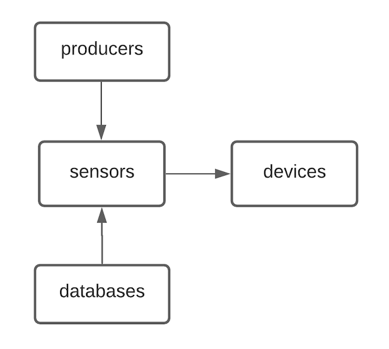
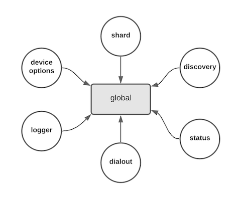

## Panoptes configuration with Consul
------------

This document will show you how to configure Panoptes with [Consul](http://consul.io) key value store. 

Panoptes can find Consul address and other configuration from one of the following options:
- Yaml configuration file
- Default configuration once you set a dash as argument. 
- Through environment variables.

```console
panoptes -consul config.yaml
panoptes -consul -
```

sample .yaml file
```yaml
address: 192.168.55.5:8500 
prefix: panoptes/config/
```

You can set environment variables with following format: PANOPTES_CONFIG_CONSUL_{{key}}
For instance: ```PANOPTES_CONFIG_CONSUL_ADDRESS=127.0.0.1:8500```

  

### Configuration specs
The Panoptes configuration categories as follows at Consul key value store:
- [Devices](#devices)
- [Sensors](#sensors)
- [Producers](#producers)
- [Databases](#databases)
- [Global](#global)

The below picture shows how the configurations link together.
 


#### Devices 
The devices is a folder which included devices as key value. key can be any name and value is in json format.
Example device configuration:

Key: core1.lax  
Value: 
```json
{ 
    "host": "core1.lax", 
    "port": 50051, 
    "sensors" : ["sensor1"],
    "username" : "demo",
    "password" : "demo"
}
```

You can see all available device config keys at [configuration reference](config_reference.md#devices). 

#### Sensors 
The sensors is a folder which included sensors as key value. key is the sensor name and value is in json format.
Example sensor configuration:

Key: sensor1  
Value:
```json
{ 
    "service": "cisco.gnmi", 
    "path": "/interfaces/interface/state/counters", 
    "mode": "sample", 
    "sampleInterval": 10, 
    "output":"console::stdout" 
}
```

You can see all available sensor config keys at [configuration reference](config_reference.md#sensors). 

#### Producers
The producers is a folder which included producers configurations as key value. key is the producer name and value is in json format.  

Example [Kafka](https://kafka.apache.org/) producer configuration:

Key: kafka1   
Value:
```json
{
    "service": "kafka",
    "config" : {
        "brokers": ["127.0.0.1:9092"],
         "topics":["interface","bgp"],
        "batchSize" : 1000
    }
}
```
The key and topics will assign to the sensor's output like: "output": "kafka1::interface" or "output": "kafka1::bgp"
Kafka output syntax: KEY::TOPIC 

You can see all available producers config keys at [configuration reference](config_reference.md#producers). 

#### Databases
The databases is a folder which included databases as key value. key is the database name and value is in json format.

Example [Influxdb database](https://www.influxdata.com/) configuration:

Key: influxdb1   
Value:
```json
{
    "service": "influxdb",
    "config": { 
    "server": "http://localhost:8086", 
    "bucket":"mybucket"
    } 
}
```
The key and a measurement name related to sensor will assign to the sensor's output like: "output": "influxdb1::ifcounters" or "output": "influxdb1::bgp"
Influxdb output syntax: KEY::MEASUREMENT

You can see all available databases config keys at [configuration reference](config_reference.md#database). 

#### Global
The global is a key not a folder and it's quite different than other configuration categories as follows:

- [Status](#status) 
- [Discovery](#discovery)
- [Dialout](#dialout)
- [Shard](#shard)
- [Logger](#logger)
- [DeviceOptions](#deviceoptions)

They are all optional and depends on what you need. for instance if you want to have sharding, you need to enable and configure Status and Discovery or if you want to change the logging level, you can configure logger.



Key: global  
Value:
```json
{
  "status": {},
  "shard": {},
  "discovery": {},
  "dialout": {},
  "logger": {},
  "deviceOptions": {},
}
```

#### Status
Panoptes has built-in self monitoring and healthcheck that they expose through HTTP or HTTPS. the Panoptes metrics are readable by Prometheus server.

Example status configuration:

```json
"status": {
    "addr": "0.0.0.0:8081",
    "tlsConfig": {
    "enabled": true,
    "certFile": "/demo/certs/panoptes.crt",
    "keyFile": "/demo/certs/panoptes.key",
   }
}
```

#### Discovery
Panoptes can register itself to Consul discovery service and it is required once you enabled the Sharding feature.

Example discovery configuration:

```json
"discovery": {
   "service": "consul",
   "config": { 
     "address": "127.0.0.1:8500",
     "healthcheckURL": "http://127.0.0.1:8081/healthcheck"
   } 
 }
```

Detailed instructions for Panoptes service discovery are found [here](discovery.md)

#### Dialout
Panoptes supports gRPC [dial-out](glossary.md#dialout) mode for Cisco MDT at the moment. you can configure it to listen on a specific address and port that should be reachable from your dial-out mode devices. 

Example Dial-Out mode configuration:

```json
"dialout": {
    "services": {
      "cisco.mdt": {
        "addr": "0.0.0.0:50055"
    	}
    }
 } 
```

#### Shards
By enabling sharding, Panoptes's nodes try to auto sharding of network devices and take over if one or more nodes have been failed. if you need details information please read [Sharding Deep Dive](shards.md)

Example Shard configuration:

```json
"shards" : {
   "enabled": true,
   "numberOfNodes": 3,
   "InitializingShards" : 1
 }
```

#### Logger
The level of logging to show and output destination after the Panoptes has started. the output can be file or console (stdout/stdin).

Example Logging configuration:

```json
"logger": {
    "level":"debug", 
    "outputPaths": ["stdout"], 
    "errorOutputPaths":["stderr"]
  }
```

#### Device Options
The device options are shared configuration between all of the devices. the device overlapped configuration is priority, it means a device configured options are preferred to global device options.

Example Device Options configuration:

```json
"deviceOptions": {
    "username": "demo",
    "password": "demo",
    "tlsConfig": { 
      "enabled": false, 
      "certFile": "/demo/certs/panoptes.crt", 
      "keyFile": "/demo/certs/panoptes.key", 
      "insecureSkipVerify": true 
    }
}
```

#### Initializing Consul

```
curl https://git.vzbuilders.com/marshadrad/panoptes/blob/master/scripts/consul/init_config.json | consul kv import -

```

#### Backup and Restore Consul
```
consul kv export > panoptes.config.json
```
```
consul kv import @panoptes.config.json
```
