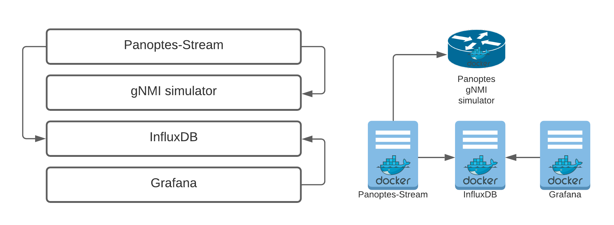
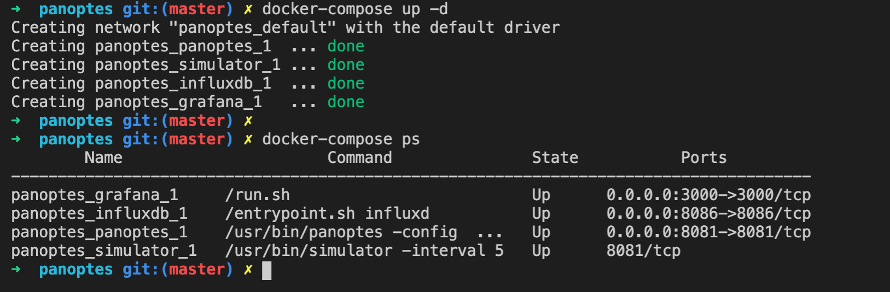
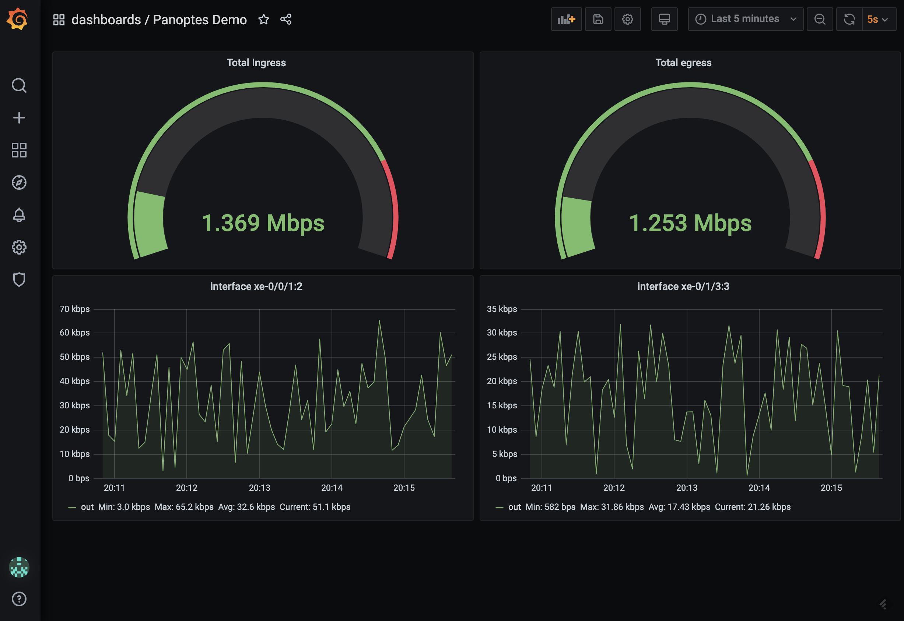

## Demo Single Node 
--------



This is a demo with Panoptes gNMI simulator. you can see the simulated data same as real devices in the grafana dashboard.

- step 1: check out the github
- step 2: start the containers 
```console
# docker-compose up -d
```

- step 3: browse http://localhost:3000 and login to grafana by user: panoptes pass: panoptes and select Panoptes Demo dashboard



- clean up
```console
# docker-compose down
```

 <span style="color:purple">All demonstrations</span>
Please check out the [demo page](demo_list.md) to see all of the demonstrations for different scenarios. 


