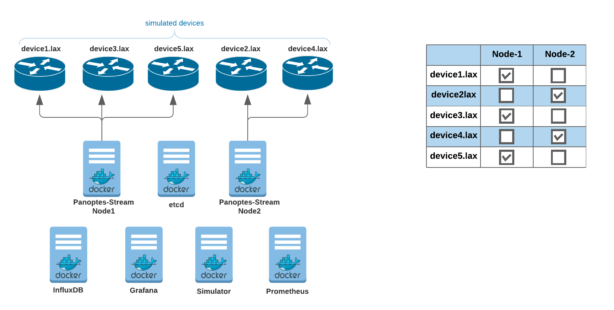
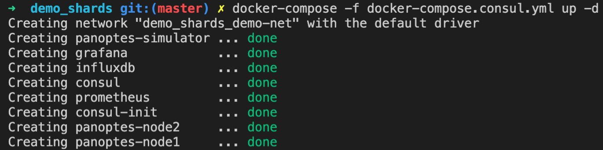
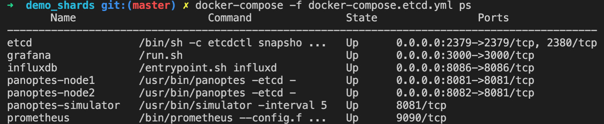
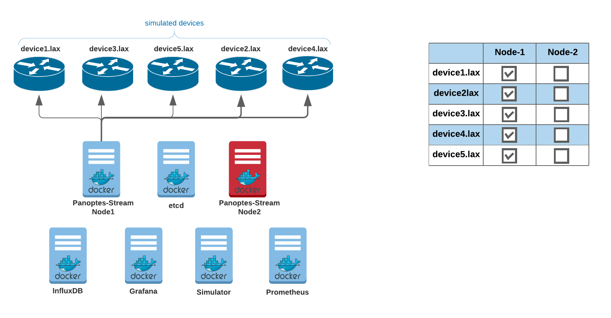

### Panoptes Shards / Cluster with etcd demonstration
---
Panoptes configuration: etcd
Service discovery: etcd

You can see this demo through http://localhost:3000 in real time once you turned the demo up.
The grafana dashboard username is panoptes and password is panoptes
This demo included 7 containers as follow:

- Two Panoptes nodes
- Panoptes gNMI simulator
- etcd
- Grafana
- InfluxDB
- Prometheus

The devices (5x simulated juniper devices) assigned to node-1 and node-2 automatically through auto sharding. it works based the hashing and modulo operation. you can see the configuration through command line (etcdctl)



#### Checkout GitHub
```
git checkout github.com/yahoo/panoptes-stream
cd panoptes-stream/scripts/demo_shards
```

#### Start the containers
```console
docker-compose -f docker-compose.etcd.yml up -d
```

```console
docker-compose -f docker-compose.etcd.yml ps
```


[http://localhost:3000](http://localhost:3000/d/2/panoptes-sharding-status?orgId=1&refresh=5s) Panoptes Sharding Status


#### Stop second node
```console
docker stop panoptes-node2
```
The node one will take over the device[2 & 4].lax in less than a minute.


#### Start second node 
```console
docker start panoptes-node2
```
[http://localhost:3000](http://localhost:3000/d/2/panoptes-sharding-status?orgId=1&refresh=5s) Panoptes Sharding Status


[http://localhost:3000](http://localhost:3000/d/1/panoptes-sharding-demo?orgId=1&refresh=5s&from=now-5m&to=now) Panoptes Sharding Demo


#### Clean up
```console
docker-compose -f docker-compose.etcd.yml down
```

 <span style="color:purple">All demonstrations</span>
Please check out the [demo page](demo_list.md) to see all of the demonstrations for different scenarios.  