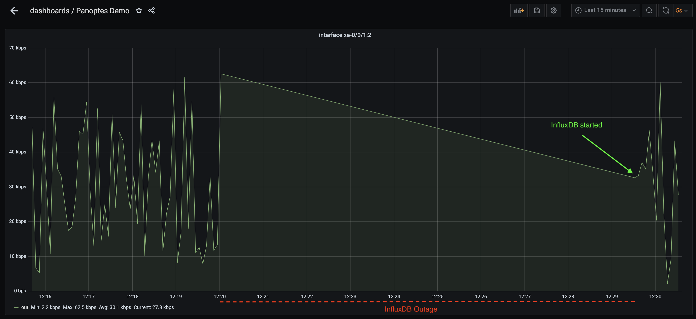
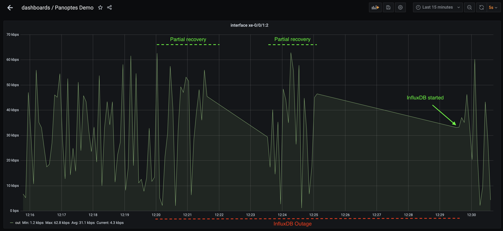
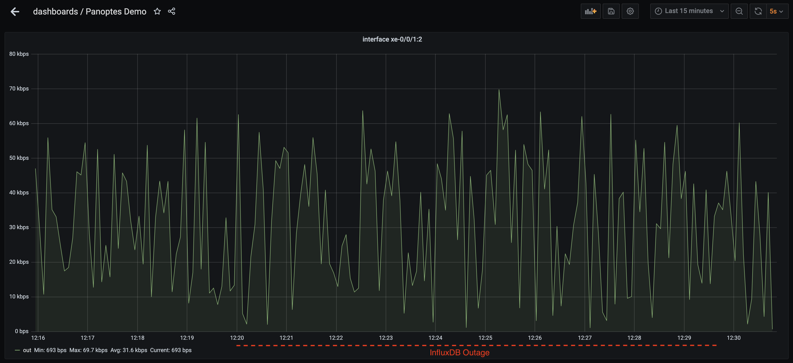

### Guaranteed Telemetry Delivery demonstration
---
You can see this demo through http://localhost:3000 in real time once you turned the demo up.
The grafana dashboard username is panoptes and password is panoptes
This demo included 5 containers as follow:

- Panoptes node
- Panoptes gNMI simulator
- Grafana
- InfluxDB
- NSQ

#### Checkout GitHub
```
git checkout github.com/yahoo/panoptes-stream
cd panoptes-stream/scripts/demo_shards
```

#### Start the containers
```console
docker-compose -f docker-compose.gtd.yml up -d
```
#### Stop and start the InfluxDB
Let's Panoptes collects and ingests metrics to InfluxDB for a few minutes then stop InfluxDB container.
```console
docker stop influxdb
```
Let's stay it down for a few minutes. During this period of time, the metrics are being written on the local drive (in our demo they write at NSQ container) through NSQ messaging queue.

Start the InfluxDB 
```console
docker start influxdb
```
Once you started InfluxDB, Panoptes starts to ingest the current metrics to the InfluxDB and after short time the metrics on the local drive will be started to ingest.

Partial Recovery.

All metrics recovered.



#### Clean up
```console
docker-compose -f docker-compose.gtd.yml down
```

More information about GTD: [Guaranteed Telemetry Delivery](/docs/gtd.md) 

 <span style="color:purple">All demonstrations</span>
Please check out the [demo page](demo_list.md) to see all of the demonstrations for different scenarios.  