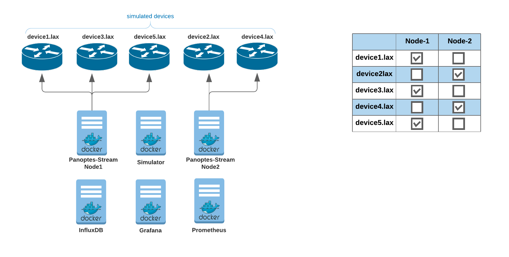
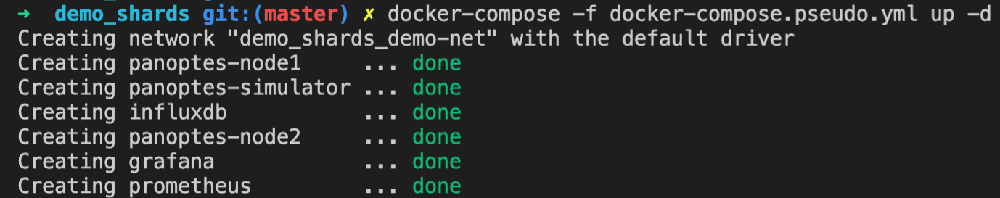
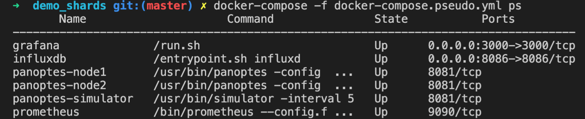
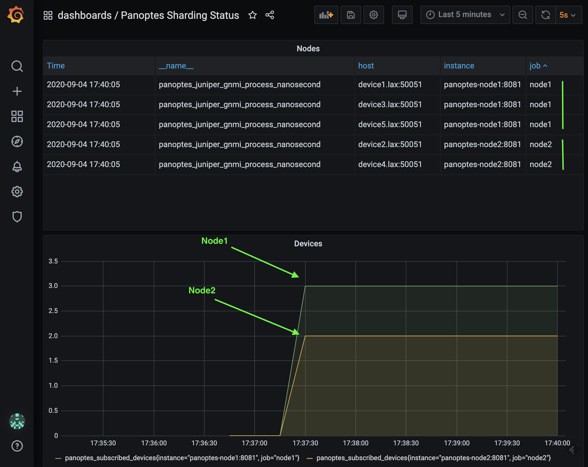
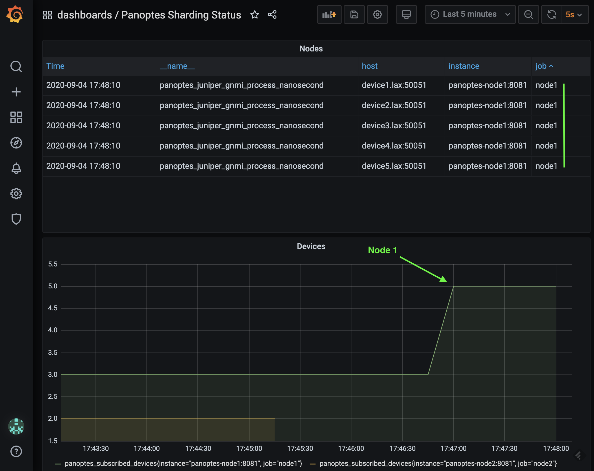
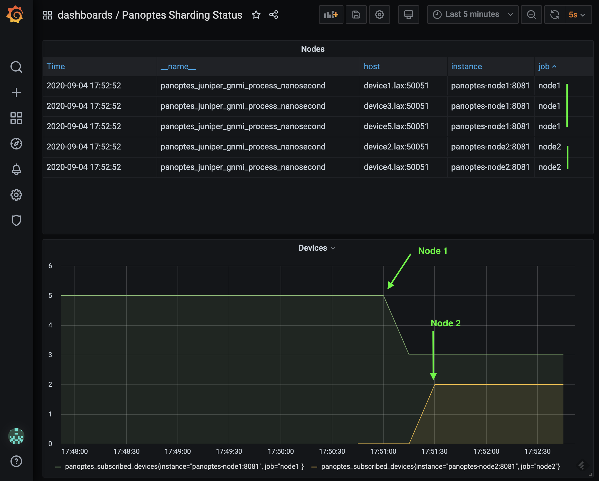
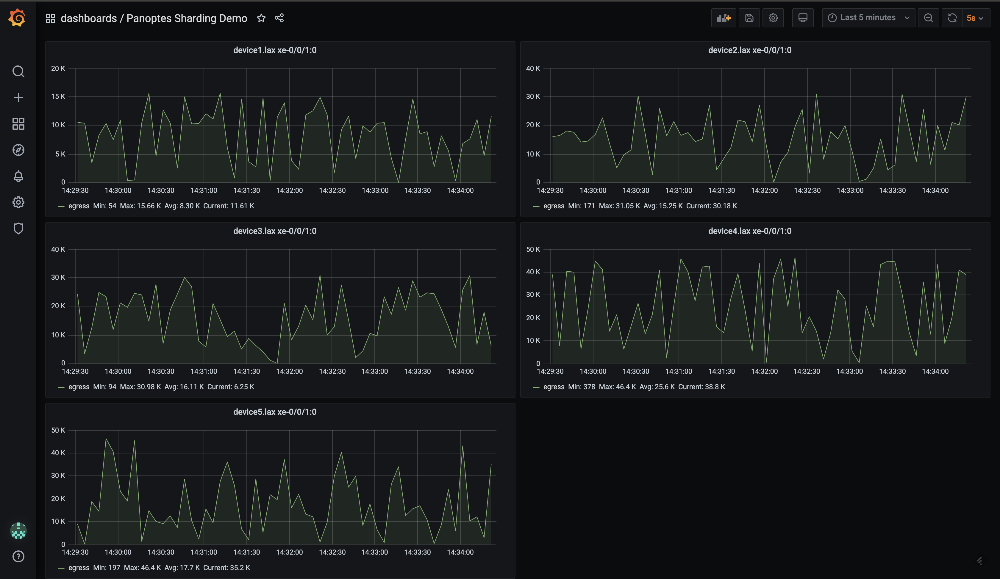

### Panoptes Shards / Cluster demonstration
---
Panoptes configuration: YAML 
Service discovery: Pseudo

You can see this demo through http://localhost:3000 in real time once you turned the demo up.
The grafana dashboard username is panoptes and password is panoptes
This demo included 6 containers as follow:
- Two panoptes nodes
- Panoptes gNMI simulator
- Grafana
- InfluxDB
- Prometheus


The devices (5x simulated juniper devices) assigned to node-1 and node-2 automatically through auto sharding. it works based the hashing and modulo operation. you can see the configuration at http://localhost:8500 (key/value: panoptes > config)


#### Checkout GitHub
```
git checkout github.com/yahoo/panoptes-stream
cd panoptes-stream/scripts/demo_shards
```
#### Start the containers
```console
docker-compose -f docker-compose.pseudo.yml up -d
```

```console
docker-compose -f docker-compose.consul.yml ps
```


[http://localhost:3000](http://localhost:3000/d/2/panoptes-sharding-status?orgId=1&refresh=5s) Panoptes Sharding Status



#### Stop second node
```console
docker stop panoptes-node2
```
The node one will take over the device[2 & 4].lax in less than a minute.


#### Start second node
```console
docker start panoptes-node2
```
[http://localhost:3000](http://localhost:3000/d/2/panoptes-sharding-status?orgId=1&refresh=5s) Panoptes Sharding Status



[http://localhost:3000](http://localhost:3000/d/1/panoptes-sharding-demo?orgId=1&refresh=5s&from=now-5m&to=now) Panoptes Sharding Demo


#### Clean up
```console
docker-compose -f docker-compose.pseudo.yml down
```


##### Panoptes configuration
Demo Panoptes configuration

```yaml
devices:
  - host: device1.lax
    port: 50051
    sensors:
      - sensor1
  - host: device2.lax
    port: 50051
    sensors:
      - sensor1
  - host: device3.lax
    port: 50051
    sensors:
      - sensor1
  - host: device4.lax
    port: 50051
    sensors:
      - sensor1
  - host: device5.lax
    port: 50051
    sensors:
      - sensor1

sensors:
  sensor1:
    path: /interfaces/interface/state/counters
    mode: sample
    sampleInterval: 10
    service: juniper.gnmi
    output: influxdb1::ifcounters

databases:
  influxdb1:
    service: influxdb
    config:
      server: http://influxdb:8086
      bucket: mybucket

discovery:
  service: pseudo
  config:
    instances:
      - panoptes-node1:8081
      - panoptes-node2:8081
    probe: http
    path: /healthcheck

shards:
  enabled: true
  numberOfNodes: 2
  InitializingShards: 1

status:
  addr: "0.0.0.0:8081"

logger:
  level: debug
  outputPaths:
    - stdout
  errorOutputPaths:
    - stderr
```

 <span style="color:purple">All demonstrations</span>
Please check out the [demo page](demo_list.md) to see all of the demonstrations for different scenarios. 