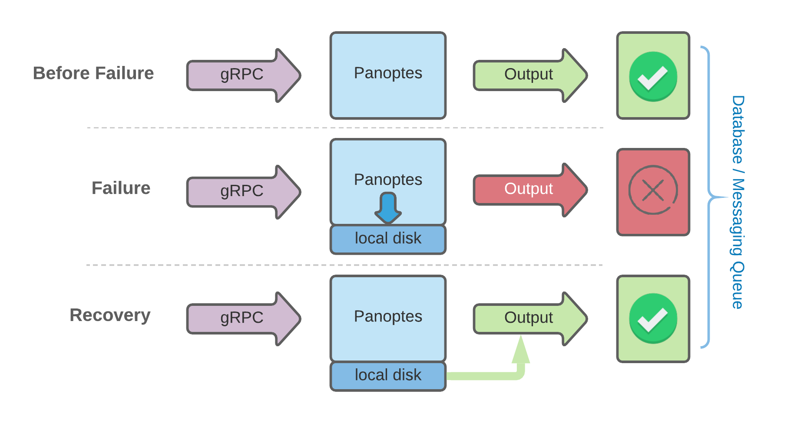

### Guaranteed Telemetry Delivery

The Panoptes can guarantee to send the collected telemetries to specified destinations even if the destination is unreachable due the network or latency problem temporarily. In other words, the non permanent destination issue can not impact metrics collection and losing the collected metrics. The Panoptes can save the metrics on the local drive and return them back to the proper destination once the destination's issue is fixed.

#### How it works

Panoptes instead of writing the dropped metrics directly to the local drive and managing them, it produces dropped metrics to the local [NSQ](https://nsq.io/) (if it's running). [NSQ](https://nsq.io/) can keep the metrics based on its configuration in the memory and persist them to disk. if you don't want to use any memory and keep all of them to disk then you need to configure NSQ with --mem-queue-size=0
Panoptes runs and manages a consumer per each output to return dropped metrics back once the issue has been fixed.

#### Configuration

There isn't any configuration for Panoptes and it activates this feature if NSQ is running on the localhost during startup.

#### Demonstration
You can try [GTD demo](/docs/demo_gtd.md) and see how it works on your laptop.
You need to install [docker](https://docs.docker.com/get-docker/), in case you don’t have it already. 