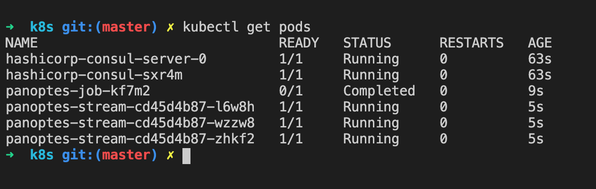
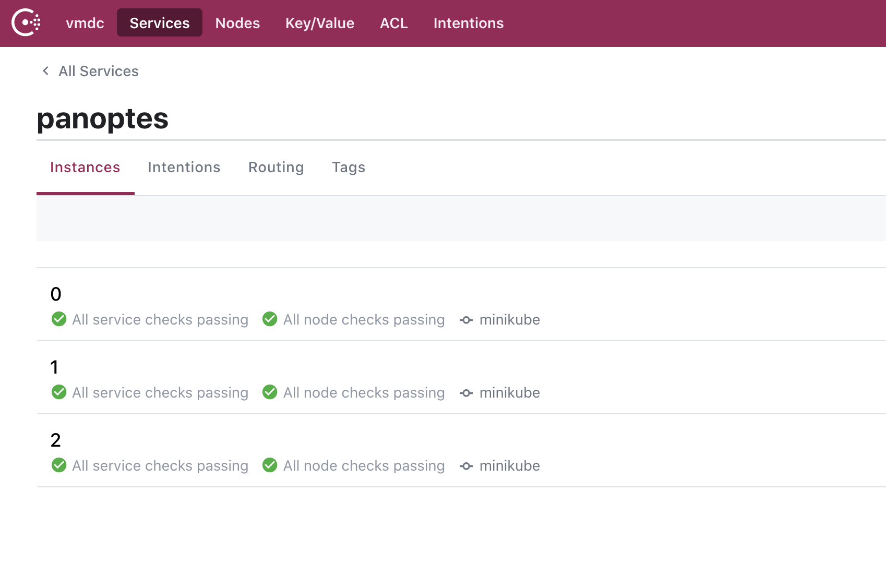
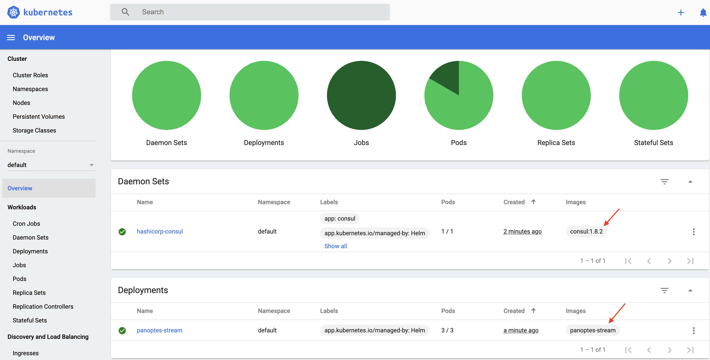

## Install Panoptes-Stream on Kubernetes
--------------

### Minikube

#### Installing [Minikube](https://kubernetes.io/docs/tasks/tools/install-minikube/)
#### Installing Consul
```console
# helm repo add hashicorp https://helm.releases.hashicorp.com
# helm install -f consul-values.yaml hashicorp hashicorp/consul
```
#### Installing Panoptes-Stream
```console
# helm install panoptes panoptes-stream
```
#### Verify by kubectl
```console
# kubectl get pods
```

#### Verify by Consul UI
```console
# minikube service hashicorp-consul-ui
```

#### Verify by Minikube dashboard
```console
# minikube dashboard
```

#### Clean-up
```console
# helm uninstall hashicorp 
# helm uninstall panoptes 
```

### Kubernetes Cluster

#### Installing Consul
Open consul-values.yaml and set replicas and bootstrapExpect to 3 or 5 
```console
# helm repo add hashicorp https://helm.releases.hashicorp.com
# helm install -f consul-values.yaml hashicorp hashicorp/consul
```
#### Installing Panoptes-Stream
Open panoptes-stream/values.yaml and set affinity: true (recommended) and edit replicaCount to any number that you need.
```console
# helm install panoptes panoptes-stream
```
#### Viewing the Consul UI
```console
# kubectl port-forward service/hashicorp-consul-server 8500:8500
```
#### Clean-up
```console
# helm uninstall hashicorp 
# helm uninstall panoptes 
```